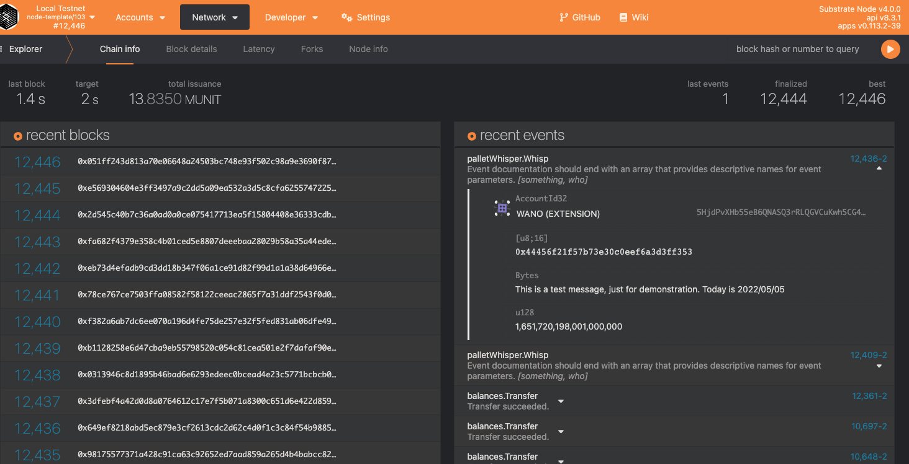
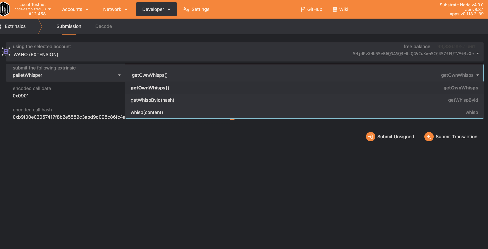

# Demo based on Substrate

This is a substrate blockchain demo.

The custom pallet create for this demo is called whisp-demo.
It does one simple just which is to submit and store a piece of message on chain.
Just like a tweet.

There is a custom frontend for this project.
[Frontend repo can be found here](https://github.com/yumingchangsabodota/whispa-demo-frontend)

Once a `whisp` is submitted to the blockchain, we can see it on the block explorer.

There are some other functions that can be called from the `whisp-pallet`.

More features can be developed in the future.

